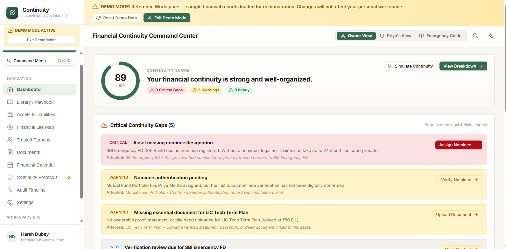

🧭 Continuity

  
 
 <strong>Plan Today. Protect Tomorrow.</strong> 
 
 A modern personal financial continuity platform designed to organize important information, improve preparedness, and bring clarity to life's unexpected moments. 
 
    

✨ Preview

  
 
 Live application preview · Click the image to open Continuity 

🎯 The Idea

Continuity is built around a simple question:

If something unexpected happened tomorrow, would your important financial information be easy to understand and access?

Continuity aims to make that preparation more organized, accessible, and actionable through a focused digital experience.

Core Focus

💰 Financial Organization · 🧭 Preparedness · 📋 Continuity · 🔐 Responsible Data

⚡ Highlights
<table> <tr> <td align="center" width="25%"> <h3>🧠</h3> <b>Clarity</b>  Turn scattered information into a structured experience. </td> <td align="center" width="25%"> <h3>💰</h3> <b>Financial Focus</b>  Designed around personal financial continuity. </td> <td align="center" width="25%"> <h3>⚛️</h3> <b>Modern Stack</b>  React + Vite with modular architecture. </td> <td align="center" width="25%"> <h3>🚀</h3> <b>Deployed</b>  Automated GitHub Pages deployment. </td> </tr> </table>
🛠️ Technology

  

Technology	Purpose
⚛️ React 18	UI & component architecture
⚡ Vite 5	Development & production builds
🟨 JavaScript / JSX	Application logic
🎨 CSS	Styling & presentation
🟩 Supabase	Data & backend services
🔧 Git	Version control
🐙 GitHub	Repository & collaboration
⚙️ GitHub Actions	Deployment automation
🌐 GitHub Pages	Application hosting
📊 Language Breakdown

  
 
  Automatically generated from the repository's current source composition.  

🏗️ Architecture
                         ┌──────────────────────┐
                         │      CONTINUITY      │
                         │     React + Vite     │
                         └──────────┬───────────┘
                                    │
              ┌─────────────────────┼─────────────────────┐
              │                     │                     │
              ▼                     ▼                     ▼
       ┌────────────┐        ┌────────────┐        ┌────────────┐
       │ Components │        │  Context   │        │   Styles   │
       │    UI      │        │   State    │        │    CSS     │
       └─────┬──────┘        └─────┬──────┘        └────────────┘
             │                     │
             └──────────┬──────────┘
                        ▼
                 ┌──────────────┐
                 │   Services   │
                 │    Utils     │
                 └──────┬───────┘
                        │
                        ▼
                 ┌──────────────┐
                 │   Supabase   │
                 │ Data Layer   │
                 └──────────────┘

Project Structure
Continuity/
│
├── .github/
│   └── workflows/
│       └── deploy.yml
│
├── src/
│   ├── components/
│   ├── context/
│   ├── data/
│   ├── icons/
│   ├── lib/
│   ├── services/
│   ├── styles/
│   ├── utils/
│   ├── App.jsx
│   └── main.jsx
│
├── imag.png
├── index.html
├── package.json
├── package-lock.json
└── vite.config.js

🚀 Run Locally
1 · Clone
git clone https://github.com/chillingbing648-sketch/Continuity.git
cd Continuity

2 · Install
npm install

3 · Start
npm run dev

4 · Build
npm run build

5 · Preview
npm run preview

🔐 Environment

If using the Supabase integration locally, configure your environment in .env.local:

VITE_SUPABASE_URL=your_supabase_url
VITE_SUPABASE_ANON_KEY=your_supabase_anon_key

Never commit secrets or private credentials.

☁️ Deployment

Continuity uses a GitHub-based deployment workflow:

   Developer
       │
       ▼
    Git Push
       │
       ▼
    GitHub
       │
       ▼
 GitHub Actions
       │
       ▼
   Vite Build
       │
       ▼
 GitHub Pages
       │
       ▼
   🌐 LIVE APP

🔗 Live

  

📈 Engineering Status
Area	Status
React Architecture	🟢
Component Structure	🟢
Supabase Integration	🟢
Production Build	🟢
GitHub Pages	🟢
CI/CD Foundation	🟢
Automated Tests	🟡
Monitoring	🟡
Production Security Hardening	🟡

Current stage: MVP / Active Development

🗺️ Next
✓ Core Application
✓ Modern UI
✓ Data Integration
✓ Deployment

→ Testing
→ Security Hardening
→ Accessibility
→ Observability
→ Advanced Planning Features

🤝 Contributing

Contributions and ideas are welcome.

git checkout -b feature/my-feature
npm install
npm run dev
npm run build
git commit -m "feat: describe change"
git push origin feature/my-feature

Then open a Pull Request.

⚠️ Disclaimer

Continuity is a financial organization and planning software project.

It does not provide financial, investment, legal, insurance, or tax advice.

🔗 Links

 <a href="https://chillingbing648-sketch.github.io/Continuity/"> 🌐 <b>Live Application</b> </a> &nbsp;&nbsp;•&nbsp;&nbsp; <a href="https://github.com/chillingbing648-sketch/Continuity"> 💻 <b>GitHub</b> </a> &nbsp;&nbsp;•&nbsp;&nbsp; <a href="https://github.com/chillingbing648-sketch/Continuity/issues"> 🐛 <b>Issues</b> </a> 

  
 
 <strong>Continuity</strong>  Plan Today. Protect Tomorrow. 

